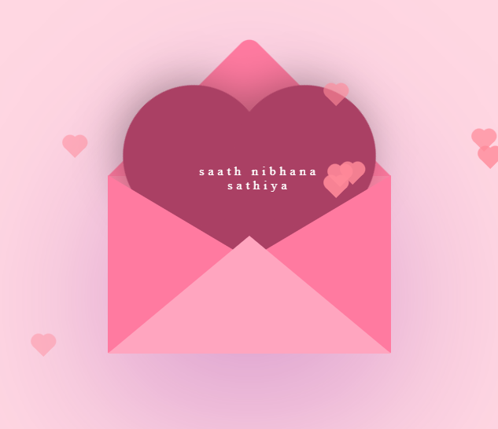
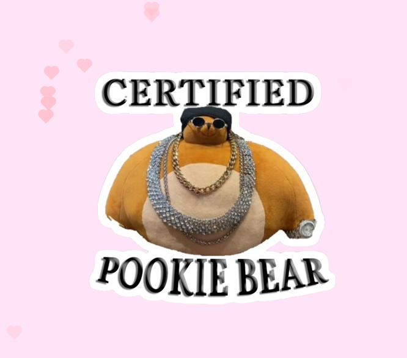

# Valentine Fullstack Development Project Documentation

## Project Overview

This project showcases a creative Valentine-themed fullstack application. It combines design, development, and automation to deliver a seamless user experience. The project includes animations built from scratch using **HTML**, **CSS**, and **JavaScript**, demonstrating custom front-end development skills. Additional features include automation for managing GitHub repositories and sending personalized Valentine cards via email.

---

## Key Components

### 1. Design Process

- **Figma for Design**: 
  - Created interactive and visually appealing Valentine cards using Figma.
  - Focused on a romantic color palette and engaging animations to enhance the user experience.
 
  


### 2. Frontend Development

- **HTML, CSS, and JavaScript**: 
  - Developed animations and interactive elements entirely from scratch without relying on frameworks.
  - **CSS Keyframes and Transitions**: Smooth, eye-catching animations for card elements.
  - **JavaScript DOM Manipulation**: Enabled dynamic user interactions like clicking, hovering, and revealing hidden messages.

### 3. Automation Features

- **GitHub Automation**:
  - Automated the creation and management of GitHub repositories for code layers.
  - Scripted processes to push code updates and track versioning efficiently.

- **Email Automation**:
  - Integrated email-sending functionality for personalized Valentine messages.
  - Used services like **SMTP or SendGrid** for reliable email delivery.

---

## Project Structure

```plaintext
valentine-project/
├── index.html        # Main HTML structure
├── styles.css        # Custom animations and styling
├── script.js         # JavaScript for interactive features
├── assets/           # Images and media
├── designs/          # Figma design files
└── automation/       # Scripts for GitHub and email automation
```

---

  


## Notable Features

### Email Personalization

- Automated sending of Valentine cards through a form submission.
- Emails are customized with recipient names and personal notes.

---

## Deployment

- Hosted on **GitHub Pages** for easy access.
- Linked automation scripts for continuous integration and version control.

---

## Future Improvements

- Add more themes for different occasions.
- Implement user-generated content for custom cards.
- Integrate AI-generated romantic messages for personalized experiences.

---

## Conclusion

This Valentine project is a fullstack application that highlights design aesthetics, frontend interactivity, and backend automation. It reflects a combination of creativity and technical skills to deliver a delightful user experience.

